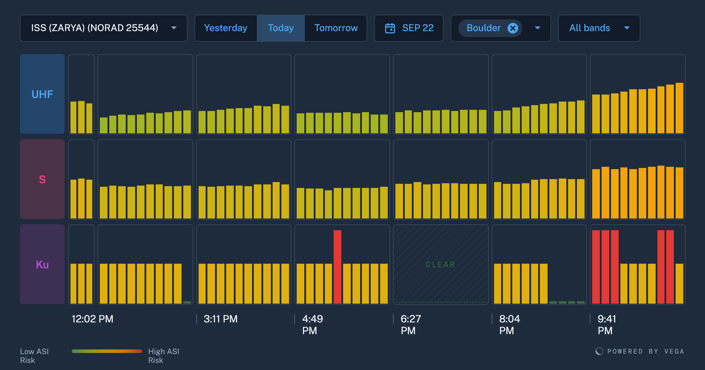

# OpenC3 COSMOS Vega Plugin

<p align="center">
  
</p>

Polls the Vega Space frontend API (`/api/v1/frontend/*` on
`admin.vega.space`) and surfaces satellite interference/coverage data as
COSMOS telemetry, plus a Timeline widget that draws the forecast as a
pass-by-band grid. The target is `VEGA` by default (`vega_target_name`);
its interface is `<target>_INT`.

Four packets are polled in the background:

- `HEALTH` - API reachability (unauthenticated)
- `APPROVED_ORGS` - organizations your API key's user has approved
  access to (first-org snapshot) - use an id from here as `vega_org_id`
- `WORKSPACE` - satellites and ground stations for `vega_org_id`
  (first-record snapshots)
- `FORECASTING_SUMMARY` - interference/coverage forecast run status,
  plus the first satellite's most recent forecast day (max intensity,
  severity, event count)

They are fetched once when the interface connects (so the CVT is populated
immediately) and then re-polled on two cadences:

- `vega_poll_period` (default 120 s) - `HEALTH` and `FORECASTING_SUMMARY`
- `vega_slow_poll_period` (default 3600 s) - `APPROVED_ORGS` and
  `WORKSPACE`, which change on the order of days

Set either to `0` to disable that periodic poll (the connect-time fetch still
runs). `WORKSPACE` and `FORECASTING_SUMMARY` only poll once `vega_org_id` is
set to a nonzero org id (see Setup). Request timeouts are `vega_read_timeout`
(default 90 s) and `vega_connect_timeout` (default 10 s).

Three more packets are fetched on demand, not polled: `DEMO_KEY` (the widget
asks for it on a fresh install), and `DAY_DETAIL` / `HISTORY` (the widget
requests them per satellite, ground station and day as the user browses).

Any non-2xx response from any command is routed to `VEGA ERROR_RESPONSE`
instead of the success packet: `HTTP_STATUS` carries the code (401 = bad or
missing key, 403 = no approved access to `vega_org_id`, 404 = unknown org or
no data in range, 429 = rate limited) and `BODY` the raw, unparsed response
(Vega returns HTML for some errors). `FORECASTING_SUMMARY RUN_STALE` reads
`OK` / `STALE` and `FIRST_SAT_DAY_MAX_SEVERITY` low / medium / high as named
states. No packet carries COSMOS limits or state colours - the Timeline
widget is the monitoring surface, and limits would raise a notification on
every response transition (a high forecast day, a 5xx during a Vega
deploy). Add `LIMITS` in your own copy of `tlm.txt` if you want the
alarms. See `targets/VEGA/screens/status.txt` for a ready-made
screen, or add the items to Telemetry Grapher / Packet Viewer.

Decommutated command and telemetry records are retained for 30 days
(`CMD_DECOM_RETAIN_TIME` / `TLM_DECOM_RETAIN_TIME` in `plugin.txt`):
`WORKSPACE` and `FORECASTING_SUMMARY` carry whole JSON arrays on every poll,
so unbounded retention grows fast. Raise it in `plugin.txt` if you need more
history.

## Plugin variables

| Variable | Default | Purpose |
|---|---|---|
| `vega_target_name` | `VEGA` | Target name. Change it to install the plugin more than once, e.g. one target per organization. Pass it to the widget: `TIMELINE <%= target_name %>` |
| `vega_hostname` | `admin.vega.space` | Vega API hostname |
| `vega_port` | `443` | Vega API port |
| `vega_protocol` | `https` | `http` or `https` |
| `vega_org_id` | `0` | Organization to poll workspace and forecast data for; `0` disables the org-scoped polls. Find ids in `APPROVED_ORGS` |
| `vega_poll_period` | `120` | Seconds between `GET_HEALTH` / `GET_FORECASTING_SUMMARY` polls; `0` disables |
| `vega_slow_poll_period` | `3600` | Seconds between `GET_APPROVED_ORGS` / `GET_WORKSPACE` polls; `0` disables |
| `vega_read_timeout` | `90.0` | Seconds to wait for an API response |
| `vega_connect_timeout` | `10.0` | Seconds to wait for the connection |

## Commands

- **GET_HEALTH** - API reachability, no key needed
- **GET_DEMO_KEY** - Vega's public read-only demo key, so a fresh install shows data
- **GET_APPROVED_ORGS** - organizations this key's user may read
- **GET_WORKSPACE** - satellites and ground stations for `vega_org_id`
- **GET_FORECASTING_SUMMARY** - forecast run status and the first satellite's latest day
- **GET_DAY_DETAIL** - one satellite, ground station and day of interference minutes (widget-driven)
- **GET_HISTORY** - measured interference over a time range (widget-driven)

## Telemetry

- **HEALTH**, **DEMO_KEY**, **APPROVED_ORGS**, **WORKSPACE**, **FORECASTING_SUMMARY**, **DAY_DETAIL**, **HISTORY** - one packet per command, JSON fields decoded by `KEY` path
- **ERROR_RESPONSE** - `HTTP_STATUS` and the raw body of any non-2xx reply, from any command

## Setup

A fresh install shows data straight away: the widget asks Vega for its
public **demo key** (read-only access to Vega's Demo Org, served by Vega so
it can be rotated at any time) and a banner above the chart says so. To see
your own satellites, click **Connect your own data** on that banner (or
*Connect your Vega API key…* in the widget's settings menu).

Two ways to give the plugin a Vega API key. Both use a **frontend API key**
(`vgk_...` prefix, scoped to one Vega user) - not an account-level API token;
the two are different credential types and are not interchangeable.

**Normal: each user enters their own key on the dashboard.** Open the
Timeline widget (`targets/VEGA/screens/forecast.txt`). If COSMOS has no
working key it shows a form: create a key at the Vega app's API Keys page,
paste it in, Connect. The key stays in that browser (localStorage) and is
sent with each command as the `HTTP_HEADER_AUTHORIZATION` parameter, which is
`OBFUSCATE`d (masked in Command Sender and the text command log) and stripped
from the packet by `targets/VEGA/lib/api_key_protocol.rb` before the command
logs are written. COSMOS never stores it.

**Optional: a shared key for the background polls.** The periodic `GET_HEALTH`
/ `GET_APPROVED_ORGS` / `GET_WORKSPACE` / `GET_FORECASTING_SUMMARY` polls that
feed the Status screen send no per-request token, so they use the COSMOS
secret `VEGA_API_KEY` if one exists: Admin -> Secrets, name `VEGA_API_KEY`,
value = a `vgk_...` key (no `Bearer ` prefix), then restart the interface so
it picks the secret up. Without it the authenticated polls are dropped
before they are sent (one warning in the interface log; the unauthenticated
`GET_HEALTH` still goes out), which is harmless - the widget still works with
a user's key. A key entered on the dashboard always wins for that request.

Then:

1. Install this plugin (see below) with `vega_org_id` left at its default
   (`0`)
2. Open the Timeline widget and connect with your key, or check
   `VEGA APPROVED_ORGS HTTP_STATUS` on the Status screen if you set the
   secret. `targets/VEGA/procedures/procedure.rb` runs that check from Script
   Runner (secret path) and then walks the status-screen alerts with injected
   telemetry.
3. Reinstall/reconfigure with `vega_org_id` set to the org id you want
   `WORKSPACE` and `FORECASTING_SUMMARY` to poll. The widget itself can query
   any org the key has access to, regardless of `vega_org_id`.

To rotate a dashboard key, use "Forget it" in the widget and enter the new
one. To rotate the secret, change its value in Admin -> Secrets and restart
the interface. Revoke keys in the Vega app if this COSMOS instance is ever
decommissioned.

## Extending

`WORKSPACE` and `FORECASTING_SUMMARY` currently expose a single "first
record" snapshot from each array in the response, since COSMOS telemetry
items are fixed-schema and `vega_org_id` only covers one org at a time. To
go further - multiple orgs at once, the full satellite/ground-station list,
per-day forecast history beyond the first day, or heatmap/track/position
endpoints (`forecasting/heatmap_slice`, `forecasting/track`,
`forecasting/satellite_position`) - either:

- add more `GET_*` commands / `KEY $.data.foo[N]...` items for specific
  indices or orgs you care about (install the plugin again with a
  different `vega_target_name` and `vega_org_id` for multi-org polling), or
- write a small script (`targets/VEGA/procedures/`) that calls `cmd`/`tlm`
  in a loop and does something more dynamic, or
- build a custom Vue tool that calls the COSMOS API directly

## What is where

| Piece | Where |
|---|---|
| Plugin variables, target, interface, polling, `WIDGET Timeline` | `plugin.txt` |
| `GET_*` commands (one per Vega endpoint) | `targets/VEGA/cmd_tlm/cmd.txt` |
| Response packets, `KEY` paths into the JSON, `ERROR_RESPONSE` | `targets/VEGA/cmd_tlm/tlm.txt` |
| API key write protocol (per-request token or secret, scrubbed from logs) | `targets/VEGA/lib/api_key_protocol.rb` |
| HTTP client interface with reconnect fix | `targets/VEGA/lib/vega_http_client_interface.rb` |
| Timeline widget screen / COSMOS-native status screen | `targets/VEGA/screens/forecast.txt`, `status.txt` |
| Smoke-test script for Script Runner | `targets/VEGA/procedures/procedure.rb` |
| Widget source (Vue 3 + Vuetify 3) | `src/TimelineWidget.vue` and `src/` |
| Built widget (generated, not committed) | `tools/widgets/TimelineWidget/` |
| Store image | `public/store_img.png` |

## Building

Needs Ruby, Node and pnpm (the gem includes the built widget).

```bash
pnpm install --frozen-lockfile --ignore-scripts
rake build VERSION=X.Y.Z
```

`rake build` runs `pnpm run build` (Vite, UMD bundle into `tools/widgets/`)
then `gem build`, and validates the gem if `openc3cli` is on the PATH.
Without a local Node environment use the OpenC3 node container:

```bash
docker run -it -v `pwd`:/openc3/local:z -w /openc3/local docker.io/openc3inc/openc3-node sh
# then, inside: pnpm install --frozen-lockfile --ignore-scripts && rake build VERSION=X.Y.Z
```

### Development loop

`bin/dev-install.sh` builds a timestamped gem and loads it straight into a
local COSMOS compose stack (through the cmd-tlm-api container, the same path
Admin > Plugins uses), upgrading any installed copy in place. Plugin
variable values come from `vars.json` (gitignored; copy the keys from
`plugin.txt`). Hard-refresh the browser afterwards - the widget bundle is
cached - and check the build stamp in the widget's settings menu to be sure
the new one loaded.

### Customizing

- **Target name.** Everything templates on `vega_target_name`; the widget
  reads the target from its screen line (`TIMELINE <%= target_name %>`).
  Only the smoke-test script hard-codes `VEGA` (procedures are not
  templated) - edit its `TARGET` constant if you rename.
- **New endpoints.** Add a `COMMAND` with the four derived HTTP parameters
  and a `TELEMETRY` packet with `ACCESSOR HttpAccessor JsonAccessor` and
  `KEY` paths, exactly like the existing ones. Point `HTTP_ERROR_PACKET` at
  `ERROR_RESPONSE` so failures land in one place. Add `HTTP_HEADER_AUTHORIZATION`
  with `OBFUSCATE` if the endpoint needs a key.
- **COSMOS version.** The widget builds against `@openc3/js-common` and
  `@openc3/vue-common` pinned in `package.json`; keep them on the same
  minor as the COSMOS you run and bump `openc3_cosmos_minimum_version` in
  the gemspec together with them. Vue, Vuetify, Pinia and vue-router are
  externals supplied by COSMOS at runtime, not bundled.
- **Source map.** COSMOS copies `<widget>.umd.min.js.map` at install
  unconditionally, so `sourcemap: true` in `vite.config.js` must stay on.
- **Limits and alarms.** No packet declares `LIMITS` on purpose (see above).
  Add them in your copy of `tlm.txt` if you want COSMOS notifications.
- **Interface subclass.** `vega_http_client_interface.rb` only drains the
  stock `HttpClientInterface` response queue on connect, which stops a
  reconnect loop after an in-process disconnect. If a future COSMOS fixes
  that, switch `plugin.txt` back to `openc3/interfaces/http_client_interface.rb`.

## Installing into OpenC3 COSMOS

1. Go to the OpenC3 Admin Tool, Plugins Tab
1. Click the install button and choose your plugin.gem file
1. Fill out plugin parameters
1. Click Install

## Contributing

Issues and pull requests are welcome at
https://github.com/Vega-Space-Inc/openc3-cosmos-vega. For anything else,
email tom@vega.space.

## License

MIT. See [LICENSE.md](LICENSE.md). Copyright 2026 Vega Space, Inc.
